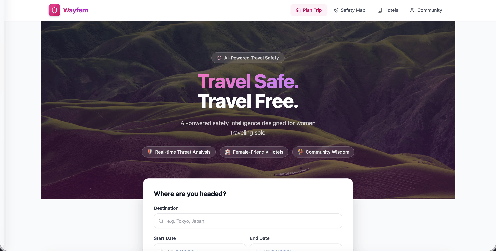

# Wayfem 🌍

**Cloud Run (live during hackathon):** https://wayfem-app-3oetgfjgkq-uc.a.run.app

> **Multi-Agent AI System for Women's Safety-First Travel Planning**  
> Wayfem = wayfare + feminine — Hackathon submission, Google-native AI stack

---

## Overview

Wayfem uses four specialized AI agents (powered by Vertex AI Gemini) to analyze safety conditions, find female-friendly accommodations, build safe itineraries, and surface community wisdom — all orchestrated via a LangGraph parallel workflow.



```
User Request (REST API)
        ↓
Orchestrator [Gemini 3.1 Flash-Lite (Preview) + LangGraph]
 ├── Safety Intelligence Agent  → travel advisories, crime reports (with sources)
 ├── Accommodation Agent        → hotels scored by Female Friendliness Index
 ├── Community Agent            → tips from women who've traveled there
 └── Schedule Agent             → safe-hours itinerary + Google Calendar export
        ↓
Firestore DB → Wayfem Itinerary Response
```

Everything runs in a **single Docker container**: the React frontend is built at image-build time and served directly by FastAPI. The Calendar MCP server starts as a background subprocess on the same container.

---

## Project Structure

```
wayfem/                        ← monorepo root
├── Dockerfile                 ← combined single-image build (frontend + backend + calendar MCP)
├── docker-compose.yml         ← local development (3 services with hot reload)
├── deploy.sh                  ← single-command Cloud Run deployment
├── test-combined.sh           ← run the combined image locally before deploying
├── backend/                   ← FastAPI + LangGraph + Vertex AI
│   ├── agents/                ← orchestrator + 4 sub-agents
│   ├── mcp_servers/           ← MCP servers (maps, search, calendar)
│   ├── mcp_client.py          ← MCP connection manager
│   ├── tools/                 ← direct API wrappers (Maps, Search)
│   ├── routers/               ← FastAPI route handlers
│   ├── models/                ← Pydantic schemas
│   ├── database/              ← Firestore CRUD
│   ├── main.py                ← FastAPI app + static frontend serving
│   ├── start.sh               ← container entrypoint (starts calendar MCP + uvicorn)
│   ├── config.py
│   ├── requirements.txt
│   └── .env.example
└── frontend/                  ← React + TypeScript + Vite + Tailwind CSS
    ├── src/
    │   ├── api/               ← Axios client + TypeScript types
    │   ├── components/        ← SafetyBadge, HotelCard, ItineraryCard, Layout, …
    │   ├── pages/             ← HomePage, TripResults, Safety, Hotels, Community, CheckIn
    │   └── hooks/             ← useTripPlan
    └── index.html
```

---

## Quick Start

### 1. Configure Environment

```bash
cp backend/.env.example backend/.env
# Fill in your API keys
```

Required environment variables:

| Variable | Description |
|---|---|
| `GOOGLE_CLOUD_PROJECT` | GCP project ID |
| `GOOGLE_APPLICATION_CREDENTIALS` | Path to service account JSON |
| `GOOGLE_MAPS_API_KEY` | Google Maps Platform API key |
| `SERPER_API_KEY` | Serper.dev API key (web search) |
| `GOOGLE_SEARCH_CX` | Google Custom Search Engine ID (optional fallback) |
| `GOOGLE_CALENDAR_CREDENTIALS_JSON` | Path to Calendar service account JSON |
| `GEMINI_API_KEY` | Gemini API key (if not using ADC) |

### 2. Local Development (hot reload)

Uses docker-compose with three separate services so the frontend dev server has hot module reload.

```bash
docker-compose up --build
```

| Service | URL |
|---|---|
| Frontend (Vite dev server) | http://localhost:5173 |
| Backend API | http://localhost:8000 |
| API Docs | http://localhost:8000/docs |
| Calendar MCP | http://localhost:8003 |

### 3. Test the Combined Image Locally

Run the exact same image that will be deployed to Cloud Run:

```bash
./test-combined.sh
```

Open http://localhost:8080 — the React app is served by FastAPI directly (no separate frontend container). First build takes ~2–3 minutes.

```bash
./test-combined.sh build   # rebuild image only
./test-combined.sh run     # run without rebuilding
```

### 4. Raw Local Dev (no Docker)

**Backend:**
```bash
cd backend
python -m venv venv && source venv/bin/activate
pip install -r requirements.txt
# Start calendar MCP in background
python mcp_servers/calendar_server.py &
uvicorn main:app --reload --port 8000
```

**Frontend:**
```bash
cd frontend
echo "VITE_API_BASE_URL=http://localhost:8000" > .env.local
npm install && npm run dev
```

---

## Deployment (Google Cloud Run)

Everything deploys as a **single Cloud Run service** — one image, one URL.

```bash
./deploy.sh           # full deploy: secrets + build + push + deploy
./deploy.sh secrets   # update Secret Manager only
./deploy.sh build     # build & push image only
./deploy.sh deploy    # redeploy (image already pushed)
```

The script:
1. Creates/updates secrets in GCP Secret Manager
2. Builds a multi-stage Docker image (`--platform linux/amd64`)
3. Pushes to Artifact Registry (`us-central1-docker.pkg.dev/<project>/wayfem/app`)
4. Deploys to Cloud Run with 2 vCPU / 2 GB RAM, 5-min timeout

---

## API Endpoints

| Method | Endpoint | Description |
|---|---|---|
| `POST` | `/api/v1/plan` | Full trip plan via multi-agent orchestrator |
| `GET` | `/api/v1/safety/{destination}` | Safety report for a destination |
| `GET` | `/api/v1/hotels/{destination}` | Female-friendly hotels ranked by FFI |
| `POST` | `/api/v1/checkin/{trip_id}` | Safety check-in |
| `POST` | `/api/v1/feedback` | Submit community tips |
| `GET` | `/api/v1/community-tips/{destination}` | Community wisdom |
| `GET` | `/health` | Health check |

### Example: Plan a Trip

```bash
curl -X POST https://wayfem-app-3oetgfjgkq-uc.a.run.app/api/v1/plan \
  -H "Content-Type: application/json" \
  -d '{
    "destination": "Bangkok, Thailand",
    "start_date": "2025-11-10",
    "end_date": "2025-11-17",
    "emergency_contact": "+1-555-0100"
  }'
```

---

## Agent Architecture

### Orchestrator (Gemini 3.1 Flash-Lite (Preview))
LangGraph `StateGraph` with parallel fan-out:
1. **parse_request** — geocode destination via Google Maps MCP, generate trip ID
2. **[PARALLEL]** safety_check + hotel_search + community_lookup
3. **merge_results** — fan-in, combine all agent outputs
4. **build_schedule** — day-by-day safe itinerary, Google Calendar export
5. **final_rank** — apply safety guardrails, final scoring
6. **store_db** — persist to Firestore

### MCP Tool Servers

| Server | Transport | Tools |
|---|---|---|
| Maps MCP | stdio subprocess | geocode, places search, area safety |
| Search MCP | stdio subprocess | travel advisories, crime reports (Serper) |
| Calendar MCP | HTTP (localhost:8003) | create events, check-in reminders |

### Safety Guardrails
- `CRITICAL` threat → destination blocked, alternatives suggested
- `HIGH` threat → prominent warning, user acknowledgment required
- Hotels below FFI 4.0 filtered unless no alternatives
- Risk flags displayed as: *"According to [Source], …"* with clickable links
- Every itinerary day includes a safe return time
- Emergency contacts always included

### Female Friendliness Index (FFI)

| Factor | Weight |
|---|---|
| Solo female positive reviews | 35% |
| Area safety score | 25% |
| Security features (locks, cameras, 24hr desk) | 20% |
| Female staff / ownership | 10% |
| Emergency proximity (hospital, police) | 10% |

---

## Tech Stack

| Layer | Technology |
|---|---|
| AI / LLM | Vertex AI Gemini 1.5 Pro + Flash |
| Agent workflow | LangGraph StateGraph |
| MCP integration | `langchain-mcp-adapters`, FastMCP |
| Backend | FastAPI + Python 3.11 |
| Database | Google Cloud Firestore |
| Search | Serper.dev (real-time web search) |
| Maps | Google Maps Platform |
| Calendar | Google Calendar API (MCP) |
| Frontend | React 18 + TypeScript + Vite + Tailwind CSS |
| Container | Single Docker image (2-stage build) |
| Deployment | Google Cloud Run (single service) |

---

## Hackathon Demo Flow

1. User enters: *"Plan a solo trip to Bangkok, Nov 10–17"*
2. Orchestrator dispatches 3 agents **in parallel** via LangGraph
3. Safety agent → `MEDIUM` threat, flags with sourced citations (e.g. *"According to US State Dept…"*)
4. Accommodation agent → 5 ranked hotels, top-scored is female-owned guesthouse
5. Community agent → tips from women who've traveled Bangkok
6. Schedule agent → safe-hours itinerary, avoids solo walking after 9 pm
7. Itinerary rendered with activity photos + per-item **"Add to Calendar"** button + bulk **"Export All (.ics)"**
8. Final output: safety score **6.8/10**, risk flags, hotel list, check-in schedule
9. Results stored to Firestore for community data loop

---

*Wayfem — Travel Safer, Travel Freer* 🌍
